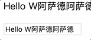
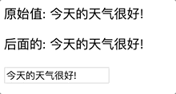
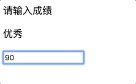
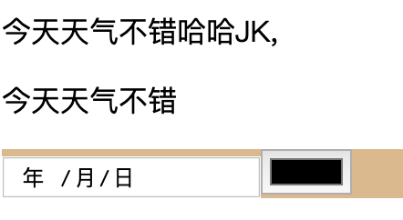

# Vue基础
### 1.初体验
```
<div class="jkBox">
    <p>{{message}}</p>
    <p>{{ni}}</p>
</div>
<script src="js/vue.js"></script>
<script>
    var jkVue = new Vue({
        el:'.jkBox',//此处对应的是选择器
        data:{
            message:'hahaha',
            ni:'你好',
        },
    });
</script>
```
<hr>

### v-model 数据双向绑定

```
<div id="app">
    <p>{{message}}</p>
    <input type="text" v-model="message">
</div>

<script>
    // 1. 创建Vue的实例
    let vm = new Vue({
        el: '#app',
        data: {  // vue中的model -> 双向数据
           message: 'Hello World!'
        }
    });
</script>
```
如图:

<hr>

### v-once
```

<div id="app">
    <p v-once>原始值: {{msg}}</p>
    <p>后面的: {{msg}}</p>
    <input type="text" v-model="msg">
</div>

<script src="js/vue.js"></script>
<script>
    new Vue({
       el: '#app',
        data: {
           msg: '今天的天气很好!'
        }
    });
</script>
```
如图:

<hr>

### v-if

```

/**v-if的判断条件为TRUE的时候才会显示标签*/
<div id="app">
    <p v-if='show'>显示</p>
    <p v-if='hide'>隐藏</p>
    <p v-if='height>1.55'>小明的身高:{{height}}m</p>
    <p v-if='height>1.95'>小明的身高:{{height}}m</p>
</div>
<script src="js/vue.js"></script>
<script>
    var jkVue = new Vue({
        el:'#app',//注意选择器,
        data : {
            show:true,
            hide:false,
            height:1.88,
        }
    });
</script>
```
<hr>

###  v-show 和 v-if 用法相似
```
/**v-show的判断条件为TRUE的时候才会显示标签*/

<div id="app">
    <p v-show="show">要显示出来!</p>
    <p v-show="hide">不要显示出来!</p>
    <p v-show="height > 1.55">小明的身高: {{height}}m</p>
    <p v-show="height1 > 1.55">小明的身高: {{height1}}m</p>
    <!--<p v-if="1">小明的身高: {{height1}}m</p>-->
</div>

<script src="js/vue.js"></script>
<script>
    new Vue({
       el: '#app',
        data: {
            show: true,
            hide: false,

            height: 1.68,
            height1: 1.50
        }
    });
</script>
```
<hr>

### v-else 

```
<div id="app">
    <!--<p v-else="height > 1.7">小明的身高是: {{height}}m</p>-->
    <p v-if="height > 1.7">小明的身高是: {{height}}m</p>
    <p v-else>小明的身高不足1.70m</p>
</div>


<script src="js/vue.js"></script>
<script>
    new Vue({
        el: '#app',
        data: {
            height: 1.88
        }
    });
</script>
```

### v-else-if

```
<div class="app">
    <p>请输入成绩</p>
    <p v-if="score >= 90">优秀</p>
    <p v-else-if="score >= 75">良好</p>
    <p v-else-if="score >= 60">及格</p>
    <p v-else>不及格</p>
    <input type="text" v-model="score">
</div>
<script src="js/vue.js"></script>
<script>
    new Vue({
        el:'.app',
        data:{
            score:90,
        },
    });
</script>

```

如图:

<hr>

### v-for

摘自网络[https://cn.vuejs.org/v2/guide/list.html#%E7%94%A8-v-for]()

#### 用 v-for 把一个数组对应为一组元素

- 用 v-for 指令基于一个数组来渲染一个列表。v-for 指令需要使用 item in items 形式的特殊语法，其中 items 是源数据数组，而 item 则是被迭代的数组元素的别名。
  

  

```
<ul id="example-1">
  <li v-for="item in items">
    {{ item.message }}
  </li>
</ul>

var example1 = new Vue({
  el: '#example-1',
  data: {
    items: [
      { message: 'Foo' },
      { message: 'Bar' }
    ]
  }
})

```

结果
- Foo
- Bar
  
在 v-for 块中，我们可以访问所有父作用域的属性。v-for 还支持一个可选的第二个参数，即当前项的索引。


```
<ul id="example-2">
  <li v-for="(item, index) in items">
    {{ parentMessage }} - {{ index }} - {{ item.message }}
  </li>
</ul>

var example2 = new Vue({
  el: '#example-2',
  data: {
    parentMessage: 'Parent',
    items: [
      { message: 'Foo' },
      { message: 'Bar' }
    ]
  }
})

```

结果
- Parent - 0 - Foo
- Parent - 1 - Bar

<br>
你也可以用 of 替代 in 作为分隔符，因为它更接近 JavaScript 迭代器的语法：

```
<div v-for="item of items"></div>
```
<hr>

#### 在 v-for 里使用对象
你也可以用 v-for 来遍历一个对象的属性。

```
<ul id="v-for-object" class="demo">
  <li v-for="value in object">
    {{ value }}
  </li>
</ul>

new Vue({
  el: '#v-for-object',
  data: {
    object: {
      title: 'How to do lists in Vue',
      author: 'Jackie',
      publishedAt: '2019-08-29'
    }
  }
})
```

结果
- How to do lists in Vue
- Jackie
- 2019-08-29

<br>
你也可以提供第二个的参数为 property 名称 (也就是键名)：

```
<div v-for="(value, name) in object">
  {{ name }}: {{ value }}
</div>
```


结果
- title: How to do lists in Vue
- author: Jackie
- publishedAt: 2019-08-29

<br>
还可以用第三个参数作为索引：

```
<div v-for="(value, name, index) in object">
  {{ index }}. {{ name }}: {{ value }}
</div>
```
结果
- 1.title: How to do lists in Vue
- 2.author: Jackie
- 2.publishedAt: 2019-08-29

<hr>

### v-text和v-html
```
<div id="app">
    <p>
        {{msg}}哈哈JK,
    </p>
    <p v-text = 'msg'>呵呵呵</p>
    <div v-html = 'html' style="background-color: burlywood">
        jkjk哈哈
        <input type="text">
    </div>
</div>
<script src="js/vue.js"></script>
<script type="">
    new Vue ({
        el:'#app',
        data:{
            msg:'今天天气不错',
            html:'<input type="date"><input type="color">',
        }
    });
</script>
```


<hr>

注意
- 在HTML输出data中我们可以用{{xxx}},但是有的时候比如网络卡的时候，会暴露出我们的{{}},所以这个时候我们就需要v-text 和 v-html
- 当我们要是渲染不出来的情况下他就会出现{{xxx}},但是我们要是用了v-text他要是渲染的慢，则加载不出来。页面上显示的就是null而不是{{message}}
- v-html则是里面要嵌套HTML标签，这个要特别小心。在不安全的页面比如注册或登录页面千万不要用这个指令。因为会出现XSS攻击。

摘自网络[https://www.jianshu.com/p/bbdbbf330185]()

### v-bind

```
<style>
    .active {
        background-color: yellow;
        font-size: 20px;
        color: aquamarine
    }
</style>

<div id="app">
    <p v-for='(college,index) in colleges' :class='index === activeIndex ? "active":""'>
        {{college}}
    </p>
    <p :style='{color:fontColor}'>今天天气很好</p>

</div>
<script src="js/vue.js"></script>
<script>
    new Vue ({
        el:'#app',
        data:{
            colleges:[
                '苏州',
                '船奇',
                '信息',
                '科技',
                '有限公司',
            ],
            activeIndex:0,
            fontColor:'green'
        }
    });
</script>


```

<hr>

### v-on

```
<div id="app">
    <p :style='{color:fontColor}'> {{msg}} </p>
    <button @click='changeContent()'>改变内容1</button>
    <button @click='changeContentColor()'>改变颜色</button>
</div>

<script src="js/vue.js"></script>
<script>
    new Vue({
        el:'#app',
        data:{
            msg:'你好世界',
            fontColor:'red'
        },
        methods :{//实例的所有函数实现
            changeContent(){
                this.msg = '测试改掉哈'
            },
             changeContentColor() {
                this.fontColor = 'green'
             },


        }
    });
</script>

```