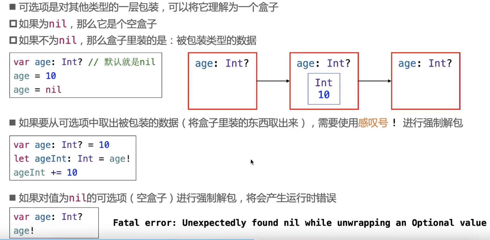
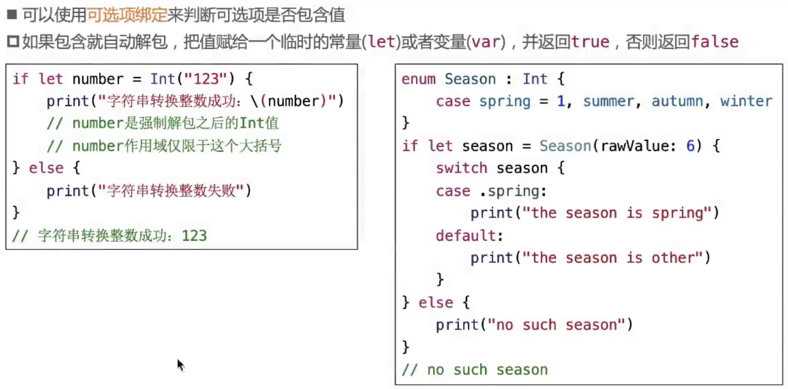
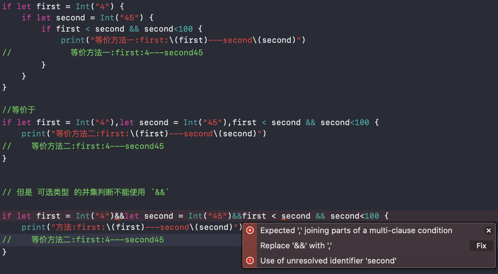
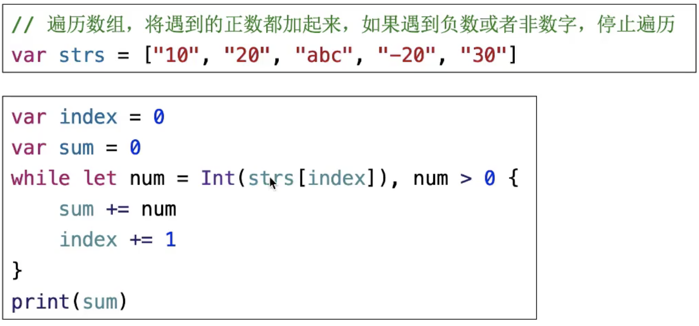
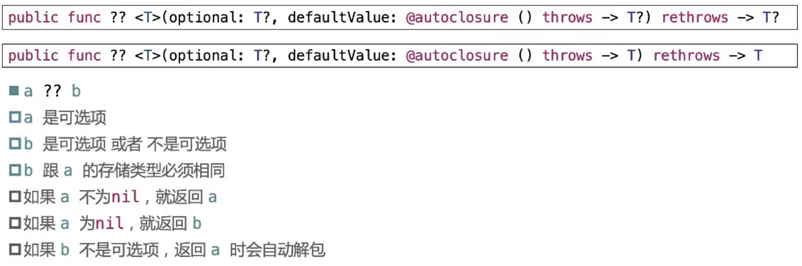
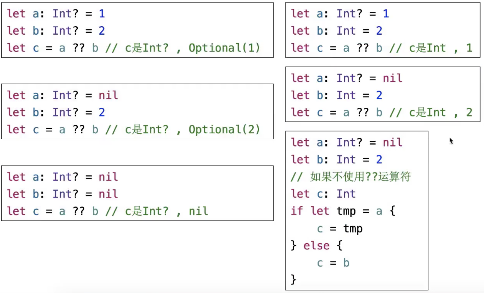

[一.可选项(Optional)](#jk1)

[二、强制解包](#jk2)

[三、判断可选项是否包含值](#jk3)

[四、可选项绑定](#jk4)

[五、While循环中使用可选绑定](#jk5)

[六、空合并运算符](#jk6)

### <span id='jk1'>一.可选项(Optional)</span>

#### 定义

- 一般也叫可选类型，他允许将值设置为<font color=red>nil</font>

- 在类型名称后面添加一个<font color=red>问号？</font> 来定义一个可选项

```swift
var name:String? = "Jack"
print(name)//Optional("Jack")

var arr = [13,16,90,0]
func getIndexValue(_ index:Int) -> Int? {
    if index<0 || index>2 {
        return nil;
    }
    return arr[index]
}
print(getIndexValue(-1))/nil
print(getIndexValue(1))//Optional(16)
```


### <span id='jk2'>二、强制解包</span>

- 简单理解：可选项是对其他类型的一层包装，可以将它理解为一个盒子
  * 如果为`nil`,则是空盒子
  * 如果不为`nil`,那么盒子里装的是：被包装类型的数据

- 如果要从可选项中取出被包装的数据(将盒子里的数据取出来),需要使用<font color='red' face="黑体">感叹号!</font>
- 如果对值为nil的可选项(空壳子)进行强制解包，会产生运行时错误

<div align=center></div>

### <span id='jk3'>三、判断可选项是否包含值</span>

```swift
var num = Int("12")
//print(num)
if num != nil {
    print("转换成功--\(num!)")//..此处注意num的强制解包 num!
} else {
    print("转换失败")
}

```
> 示例应注意:注意num的强制解包 **num!**

### <span id='jk4'>四、可选项绑定</span>
<div align=center></div>

> 注意可选项绑定在判断条件并集的条件时不能使用`&&`符号
<div align=center></div>

### <span id='jk5'>五、While循环中使用可选绑定</span>

<div align=center></div>

> 注意:并集的判断条件`,`


### <span id='jk6'>六、空合并运算符</span>
<div align=center></div>
<div align=center></div>
<hr/>

